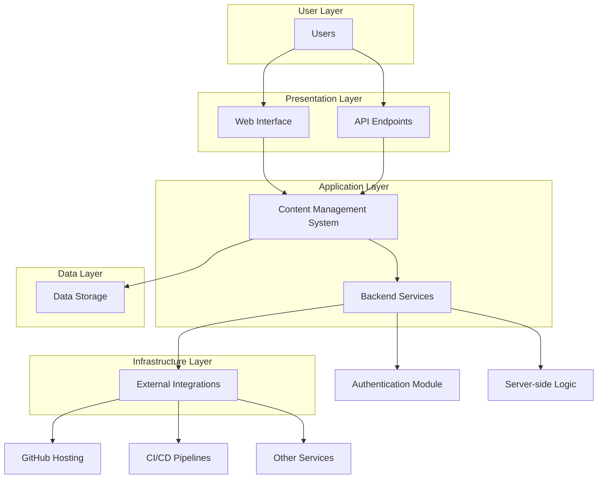

# Architecture Overview

This document provides an overview of the architecture for the "publicacientiespiritual" repository, which appears to be a platform for spiritual scientific publications. The repository hosts content related to spiritual and scientific themes, likely using static site generators or content management tools.

## Key Components

The following diagram illustrates the high-level architecture:

## Description

- **User Interaction Layer**: Handles user access through web interfaces and APIs.
- **Content Management System**: Manages publications, articles, and content creation.
- **Data Storage**: Stores content, user data, and metadata.
- **Backend Services**: Includes authentication, server logic, and integrations.
- **External Services**: Integrations with GitHub for hosting, CI/CD for deployment, etc.

This architecture supports a scalable platform for publishing and accessing spiritual-scientific content.